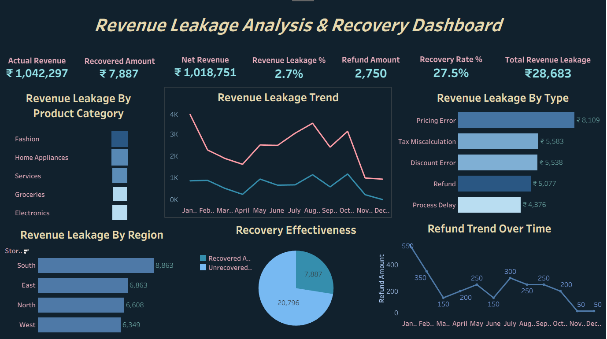

# Revenue Leakage Analysis & Recovery Strategy

## Project Overview
This project focuses on identifying, quantifying, and analyzing revenue leakage using an interactive Tableau dashboard. The analysis highlights where revenue is being lost, the key drivers behind leakage, and how effective current recovery mechanisms are, enabling data-driven decisions to improve net revenue and operational efficiency.

---

## Business Problem
Revenue leakage caused by pricing errors, tax miscalculations, refunds, discount issues, and operational delays can significantly reduce profitability. Without clear visibility into leakage sources and recovery performance, organizations struggle to control losses and optimize financial outcomes.

This project addresses these challenges by providing a structured analytical view of revenue leakage and recovery trends.

---

## Dashboard Preview

---

## Key Metrics
- Actual Revenue
- Net Revenue
- Total Revenue Leakage
- Revenue Leakage Percentage
- Recovered Amount
- Unrecovered Amount
- Recovery Rate

---

## Analysis & Insights

### Revenue Leakage by Region
- Identifies regions contributing the highest revenue loss
- Highlights regional performance gaps for focused corrective actions

### Revenue Leakage by Product Category
- Compares leakage across multiple product categories
- Helps prioritize categories requiring tighter pricing and process controls

### Revenue Leakage by Type
- Pricing Errors
- Tax Miscalculations
- Discount Errors
- Refund Issues
- Process Delays

### Trend Analysis
- Monthly revenue leakage trend to identify recurring and seasonal patterns
- Refund trends over time to assess operational inefficiencies

### Recovery Effectiveness
- Comparison of recovered vs unrecovered revenue
- Evaluation of current recovery performance and improvement opportunities

---

## Tools & Technologies Used
- Tableau – Interactive dashboard creation and data visualization
- Excel / CSV – Data preparation and preprocessing

---

## Files Included
- Revenue_Leakage_Analysis.pptx – Project presentation
- Revenue_Leakage_Analysis_Report.pdf – Detailed project report
- RRevenue_Leakage_Dashboard.png – Tableau dashboard screenshot

---

## Business Outcome
This analysis enables organizations to:
- Identify key revenue leakage drivers
- Improve pricing, discount, and tax accuracy
- Strengthen recovery strategies
- Reduce refund-related losses
- Enhance overall financial performance through actionable insights
